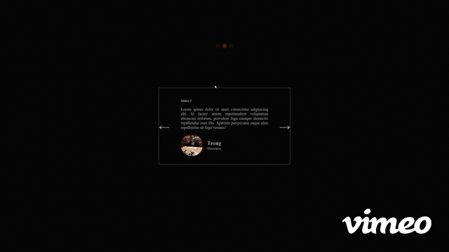

# Sliders

1) Create HTML markups
2) Simple CSS styling
3) DOM manipulations:

- Select all DOM elements using querySelector and querySelectorALL
- The two arrows: left and right when clicked will slide to the next element. If there is no element remaining, it'll slide back to the its original place.
- The three dots is created using insertAdjacentHTML and dataset attribute so it programmatically create the same amount of dots coresponding to the number of slides available
- Add 'active' class to current slide with a higher opacity using classList.remove and classList.add
- Keyboard keydown for 'RightArrow' and 'LeftArrow' using 'keydown' event

  

